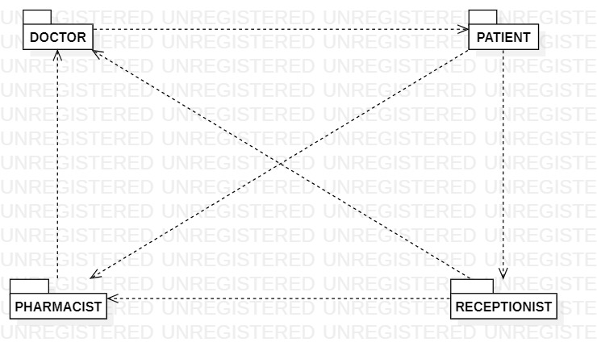
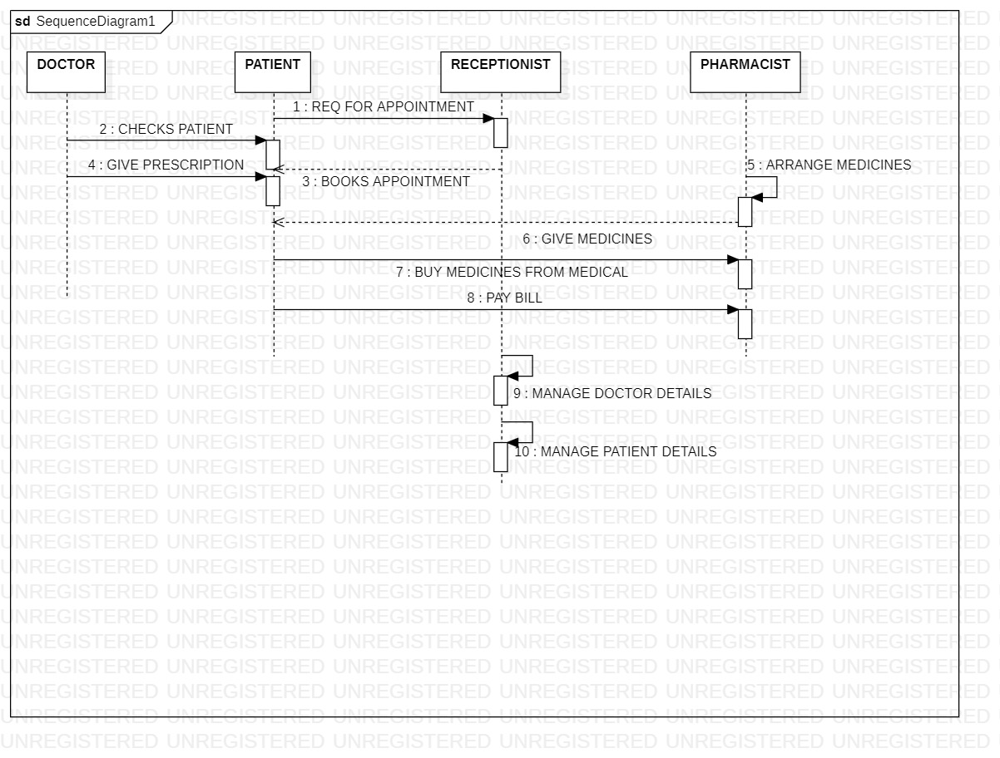

# Exp - 4 HOSPITAL MANAGEMENT SYSTEM

# AIM:
To study the problem statement, SRS document and draw all the UML diagrams of a Hospital Management System.
# SRS (Procedure):
Step 1 - Open StarUML and start a new project.
Step 2 - Name the project based on the system (e.g., ATM, Library).
Step 3 - Identify actors and use cases from the system requirements.
Step 4 - Choose and draw diagrams (Use Case, Class, Sequence, etc.).
Step 5 - Add elements using the toolbox and connect them properly.
Step 6 - Label all components clearly and meaningfully.
Step 7 - Save and export diagrams as images or PDF.
# DIAGRAMS:
USECASE DIAGRAM

CLASS DIAGRAM

ACTIVITY DIAGRAM

COMMUNICATION DIAGRAM

PACKAGE DIAGRAM

SEQUENCE DIAGRAM

# RESULT:
Thus, a Hospital Management System was created successfully.